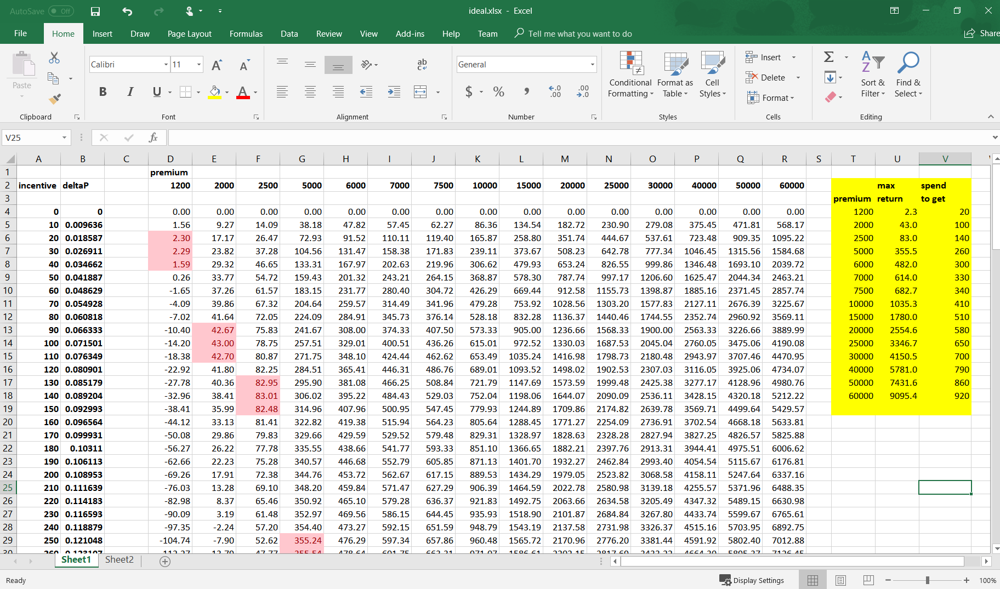

```{r, echo=F}
knitr::opts_chunk$set(error = TRUE)
```

Background:  Decided to participate in a short 'over the weekend' data science hackathon. No aspirations of placing, just learning.  What I'm presenting here is my interpretation of the question, and approach to the problem.  (Unfortunately, there was some ambiguity as to the actual structure of the problem*)  


## Problem Statement   
Basically a two-parter. **Part A**  You, a data scientist at an insurance company, are trying to predict the probability of policy renewal for each customer (standard 'churn' problem, logistic regression).  **Part B** was the optimization, and my main focus here:  You can spend extra (**Incentives**) to have agents pay closer attention to clients, and thereby gain an **Increase in Probability of renewal**. This relationship is **not linear**, but rather defined the figure below.  

```{r, message=F}
pacman::p_load(tidyverse, plotROC, pROC, DMwR2, plotly)
fun.3 <- function(x) .2*(1-exp(-2*(1-exp(-x/400))))
p <- ggplot(data=data.frame(x=0), mapping = aes(x=x))
q <- p + stat_function(fun = fun.3)+xlim(0,1500)+ylim(0,.175)+
  xlab('Incentives Spent to Increase Renewal Probability')+
  ylab('Increase in Prob: delta_P')
ggplotly(q)
```

**Terms** 

* `Incentive` money spent to improve Probability of Renewal  
* `Premium` cost of the policy
* `P(baseline)` model's predictions of renewal probability, before incentives
* `delta_P` improvement in Probability of Renewal from Incentive
* `P(incentivized)` is the improved Probability of Renewal, after incentives, so `P(baseline)` + `delta_P`
   

### The Goal  
The optimization (Part B) is to maximize the following formula for `Total Net Revenue`, summed across all the rows of the dataset:    

  ( `P(incentivized)` * `Premium` ) - `Incentive`
  
Basically, you are multipling the Premium (revenue), by your odds of receiving it (renewal probability), after accounting for costs (in this case, just the incentive to boost renewal probability).  This is summed across all individual clients (rows in the dataset).  *Real life is more complicated, the goal here is a simple optimization toy problem.  *

**My approach:**  Work out the relationships between variables using function approximation.  

### Considerations

* Probability ranges from 0-1.  If a customer is predicted to have a high probability of renewing their policy, no matter how much you spend on incentives, their renewal probability cannot be >1, by definition.  
    - In other words, **the maximum revenue per policy, before subtracting incentives, is the Premium.**   
* You'll want to maximize policies with high `P(baseline)` to 1, because small `delta_P`s don't cost very much (curve is steepest close to origin).  It's also the majority of cases, ~94%.  
    - That seems silly and probably not something you'd do in real life, BUT the problem did not account for compensation of the agent, so **your only goal is to maximize revenue according to the formula given.**  
* The smaller the premium, the smaller the 'upper limit' will be on incentives:  the increase in probability `delta_P` has a fixed cost, but the revenue boost it provides (`delta_P` \* `Premium`) is a function of the Premium. 
    - Introducing *revenue-related* term `ROI`, to differentiate: the ROI is the revenue-gain for applying the incentive, without consideration of P(baseline))
    - ROI formula: `delta_P`\*`Premium` - `Incentive`  
    - **The optimum ROI will depend on the premium amount.** 
  

## Scoring Metric   
Scoring was a weighted average that favored (70% of score) the AUC for your Part A solution, with the remaining ~30% calculated from your total net revenue.  I've included some code at the end to approximate this (solution checker page taken down after competition, boo)  

## EDA + Model
A simple logistic regression on untransformed variables performed fairly well in this case.  (predictor variables included: age, number of premiums paid on time/late, income, and underwriter/credit score).  
The classifier isn't the focus here, so I'll just show the quick and dirty code for Part A.  The `DMwR2` package in R makes kNN imputation quite easy - as there were a handful of NAs in both the training and test sets.
```{r, cache=T}
train <- read.csv('train.csv')
trainCC <- knnImputation(train[,-c(1)])
lr0 <- glm(renewal ~ ., data = trainCC, family = 'binomial')
lr0pred <- predict(lr0, trainCC, type = 'resp')
trainCC$lr0pred <- lr0pred
ggplot(trainCC, aes(d=renewal, m = lr0pred))+geom_roc()
roc <- roc(trainCC$renewal, lr0pred); auc<-roc$auc; auc # on training
```

Sometime soon I'll make a companion post exploring how to optimize the binary classifier model. But since the best AUC I saw was ~0.85, I call that darn good for a first-pass.  FWIW, feature engineering/transforms did little to enhance the model, according to several of the top-ranked participants, and my own fiddling (quite frustrating!).


## Optimization Strategy  
The first step was to figure out the optimum 'ROI' for Incentives, across the range of policy premiums.  The smart way is to plot the equation, where z = ROI, x = Incentives, and y = Premium.  It gives you a 3d surface - find the equation that defines the maximum for each x,y and you're all set. 
```{r, eval=F}
fun.3d <- function(x,y) (.2*(1-exp(-2*(1-exp(-x/400))))*y) - x
```
Except I don't have the math skills to make that happen. The plot sure is pretty though...

```{r}
incentives <- seq(0,1000,10)
premium <- seq(1200,60000, length.out=101)
roi <- as.matrix(read.csv('surface.csv', header = F))

plot_ly(x=~incentives, 
        y=~premium,
        z=~roi) %>% add_surface() 
```


Instead I turned to (old faithful) Excel, and plotted a poor man's 3d surface.  We already know the relationship between `Incentive` and Increase in Probability `delta_P`, so we can multiply the latter by a range of premium amounts, and deduct the incentives paid to calculate the `ROI` (see below).  Then you can use conditional formatting to easily spot the top 3 values per column.  



The highlighted table in yellow is a list of values we can now *fit* to get a good approximation of that relationship. The output of that fit will tell us the optimal `Incentive` for each value of `Premium `.  **Note:** ideal `incentive` maxes out at ~920, for the 60k upper limit on the range of policy Premiums in our dataset.  Because of the asymptotic shape of that curve, it makes sense there is an upper limit, and that corresponds to an Percent Increase `delta_P` of 0.1669. 

```{r}
ideal <- read.csv('ideal.csv', header=T) # from excel
colnames(ideal) <- c('premium', 'incentive')
tail(ideal)
range(ideal$incentive)
ggplot(ideal, aes(x=premium, y=incentive))+geom_point()
```

Now, this part will not make sense to most people - but since my background is in Pharmacology, I thought "gee that looks an awful lot like a dose response relationship." (The top half of a sigmoidal curve going through the origin.)  So, I downloaded the [`drc` package](https://cran.r-project.org/web/packages/drc/index.html)  to fit the data.  *I guess you'll just have to trust me that it makes sense (and I'm sure there are other packages and formulas that would approximate the fit just fine).   *
```{r, message=F, warning=F}
library(drc); library(modelr)
drc <- drm(incentive ~ premium, data = ideal, fct = LL.4(), type = 'continuous')
rsquare(drc, ideal)
plot(drc, log = '', cex = 2)
```

Looks pretty close.  Now we can call `predict()` to get the optimal `Incentive` as a function of `Premium`! 

### 'Room' for Improvement  
Now.. What about people who are already very likely to renew their policy?  We used Excel and curve fitting to calculate the *ideal maximum amount* to spend on `Incentive`, as a function of `Premium` - above which our ROI starts to decline.  But people with a low  Probability of Renewal `P(baseline)` are a relatively small portion of the dataset (~6%).  Performing well *overall* will require optimizing ROI from the majority who are already near P(baseline)=1.  
  
Also noted from the Excel sheet: **spending less than the optimal amount never resulted in a negative ROI.**  In other words, *it is always worth spending a little to bump up your P(baseline) to 1, even if it was already very high. *  

 
Therefore, the first step on the test set is to calculate how much 'room' for improvement there is before you hit P(renewal) = 1.  That is simply `1 - P(baseline)` -- which again is just the output of our logistic regression model.

```{r, cache=F}
test <- read.csv('test.csv') #read in
testCC <-  knnImputation(test[,-c(1)]) # don't use id for knn
testCC <- cbind(id = test$id, testCC) # add it back
testPred <- predict(lr0, testCC, type = 'response')  # get P(baseline) for test set
testCC$pred <- testPred  # add back to dataframe
testCC$room <- 1 - testCC$pred # calculate room for improvement
```

### Solve for X (?!)   
OK, next is where we run into a problem: We have a new **maximum** for how much we *should* incentivize (ideally), but in units of Y/`delta_P` (based on the relationship we already have for those variables; see fun.3 above).  We want to calculate `Incentive` as a function of `delta_P`, when delta_P is dictated by 'room.'  

AND, the equation is ridiculously complicated, to the point that [Wolfram Alpha](http://www.wolframalpha.com/) can’t even solve for X. We could go back to school for a math degree, OR… use another function approximation from observable data points.

```{r}
y = seq(0,1000, 10) # range of incentives, new Y
deltaP <- fun.3(y) # Increase Prob for range of incentives, new X
solveX <- data.frame(x=deltaP, y=y)
solveX <- solveX[2:101,] # get rid of origin, zeros
tail(solveX)
plot((solveX$x), log(solveX$y))
```

So, it sort of looks like a 3rd order polynomial might approximate, but on closer inspection that doesn't work very well.  Instead, we'll get rid of the values of `delta_P`/x above about .12, and try to use the dose response curve fit once again (we mostly care about the low values of delta_P that will dictate `Incentive` in cases where P(renewal) is already high).

```{r}
solveX<- solveX[1:28,]
s <- ggplot(data=solveX, aes(x=x, y=y))+geom_point()+
  scale_y_log10(); s
solveX$log10incent <- log10(solveX$y)
drc2 <- drm(log10incent ~ x, data = solveX, fct = LL.4(), type = 'continuous')
rsquare(drc2, solveX)
plot(drc2, log = '', cex = 2, xlab = 'delta_P')
```

Well, it's not perfect, but R-squared is pretty good.  

We'll use this to calculate what the incentive should be, when the `room` for improvement is **less than** what the ideal incentive (only a function of `premium`) would suggest.  

Here is the code to finish these calculations on the test set to get our predictions. If you followed along so far, this should be no problem.  
```{r}
testX <- testCC[,c(1,12:14)] # dplyr 'select' knitr fail

testX <- testX %>%
  mutate(ideal_incentive = predict(drc, testCC[c('id','premium')])) %>% # optimum based on premium
  mutate(ideal_delta_P = fun.3(ideal_incentive)) %>% # delta_P for ideal incentive
  mutate(actual_delta_P = pmin(room, ideal_delta_P)) %>%  # take lower
  mutate(p_incentives = pred + actual_delta_P) %>% 
  mutate(incen_room = 10^(predict(drc2, data.frame(x = room)))) %>% # remember y was log10(y)
  mutate(incentives = pmin(ideal_incentive, incen_room)) %>% # take the lower value
  mutate(new_prob = fun.3(incentives) + pred) # sanity check

head(testX, 10)
```
Cool, check out line 8, where out new overall probability of renewal (`p_incentives`) is 0.9978. Is that just the error in our function approximations?  Nope, it's actually dictated by the ideal_incentive/ideal_delta_p, which is a hair less than what we have 'room' for (.125 vs .127). Neat, math is fun!   
Line 7 on the other hand, started at ~.59 and had plenty of `room` -- but, since the policy amount was low (3300), so was the ideal_incentive, so he ends up with a new renewal probability of only ~.69.  


## Evaluation  
**Of me:** I got distracted as the deadline approached, and never submitted for a final score.  I *had* made submissions that were on the top ~1/3 of the leaderboard before figuring out the optimization part.   
**Of the platform** it's a dud for people coming to learn:  
  
* doesn't automatically submit your best score  
* the data, the problem decription, and solution checker are all taken down after the competition closes  (I thought perhaps because it was a problem used for hiring/interviews, but its the same for all past competitions)  
* the ambiguity referenced earlier- there was actually a typo in the description of a variable, and the formulas given described increase in probability on a 0-100 scale. I'm sure most people caught it but just seems lazy.  
* No clarification of said ambiguity offered during the hackathon despite a Slack channel dedicated to it, and people asking for clarification.


A bit anti-climactic I suppose. **Lesson learned:  Stick to Kaggle if you're learning. **   
    
If you have some optimization experience or math chops, I'd love to know the 'right' way to go about this problem, **so if you have an opinion or alternate strategy, even a link to a useful tutorial, please share!  **  

Here is some code to approximate your score on the test set (which is pretty easy to do, if you just use AUC on the training data)
```{r}
# revenue without incentives, wi
# 0.9 threshold for renewal
wi <- sum(
  (ifelse(testX$pred>=.9, 1, 0) )*testX$premium) # 328M

# total possible revenue; sum of premiums
all <- sum(testX$premium) # 371M

# your revenue after incentives
rev <- sum((testX$p_incentives*testX$premium)-testX$incentives) # 366M

incent_score <- (rev-wi)/(all-wi); incent_score

score = (.7 * auc) + .3*(incent_score); score
```
Just a quick way to check your own ideas re: optimization.  You would do a test-train split if you wanted to have a better idea of out-of-bag performance of your binary classifier. 


  


